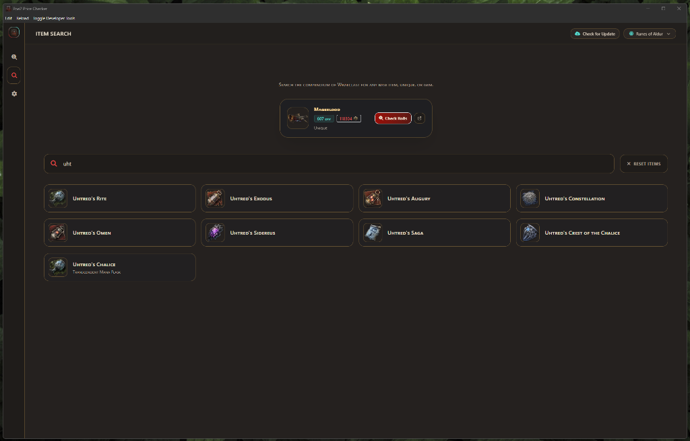
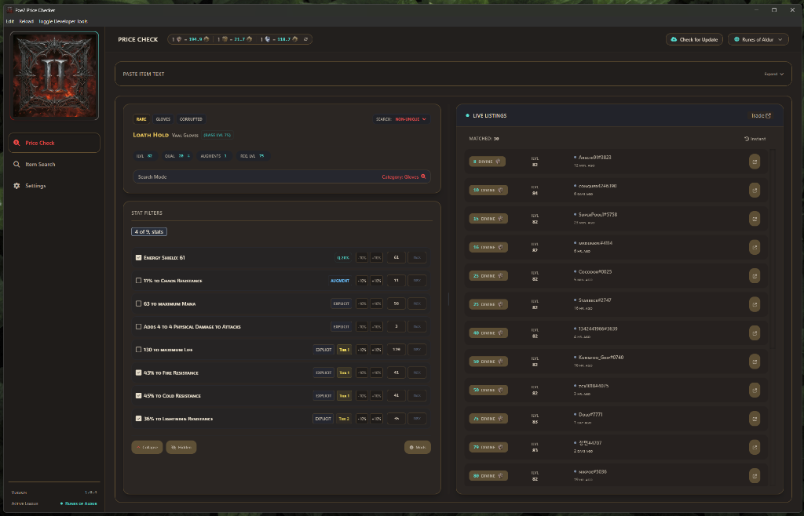

#  Poe2 Price Checker

Poe2 Price Checker is a standalone desktop application for **Path of Exile 2**, built to facilitate fast price checking, item parsing, and market analysis. It operates entirely as an independent desktop window and does not use game-overlay hooks.

## Features

### Instant Price Checking
The application monitors window focus in the background. Hover over an item in Path of Exile 2 and press `Ctrl + D` to trigger a price check. The application window will populate with the parsed item details and live market prices.

### Intelligent Item Parsing
- Parses copied items directly from the clipboard.
- Supports advanced magic item parsing, including accurate recognition of specialized modifiers (e.g., `+3 to Level of all Projectile Skills` on Magic bows).
- Displays clear modifier breakdowns.

## Tool Showcase

| Base Types & Search | Item Pricing & Filters |
| :---: | :---: |
|  |  |

## Installation

You can choose between two versions of the application:

### Option A: Setup Installer (Recommended)
1. Download the latest `Poe2-Price-Checker-Setup-1.0.1.exe` from the Releases page.
2. Run the installer to install the application on your computer.
3. Once installed, it will automatically launch and check for updates in the background.

### Option B: Portable Version
1. Download the latest `Poe2 Price Checker 1.0.1.exe` portable executable from the Releases page.
2. Run the `.exe` directly. It is completely self-contained.
3. If an update is available, it will automatically open the GitHub Releases page in your default browser for you to download the new version.

After launching, hover over an item in **Path of Exile 2** and press `Ctrl+D` to perform a price check.

## Usage & Settings
- **Closing the Application**: To completely close the application, right-click the `Poe2 Price Checker` icon in the system tray and select **Quit**.
- **Minimizing**: Clicking the `X` on the window will hide the application to the system tray. To show it again, double-click the tray icon or right-click and select "Show Window".
- **Settings**: Configuration options are accessible via the gear icon within the application's interface.

## Credits & Origin

This project is a specialized fork of Exiled Exchange 2 (which itself is a fork of Awakened PoE Trade).

**Key modifications in this fork include:**
- Completely rewritten as a standalone desktop application (removal of the overlay engine).
- Support for parsing Magic items and explicitly identifying complex prefixes/suffixes.
- Dedicated Tier filters for base types (e.g., Evasion-only boots).
